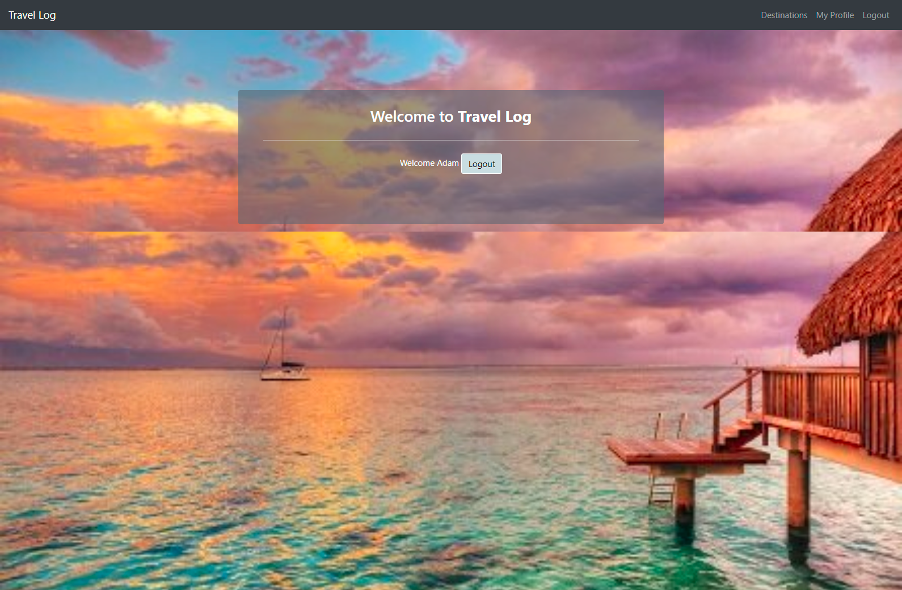

# Project 2 Travel Log

Created a full-stack web app that allows users to log the destinations they have visited.  

## Live Application & GitHub Link

[Link to webiste](travel-log-3000.herokuapp.com)

[Link to Github repo](https://github.com/adambowers09/project2)

## Technologies Used

* Node.js
* Express.js
* Handlebars.js
* MySQL / Sequelize
* Heroku
* Google Maps API
* JavaScript

## Installation

Run "npm i" from root directory.  Run "npm start" to start the webserver.

## Screenshot

